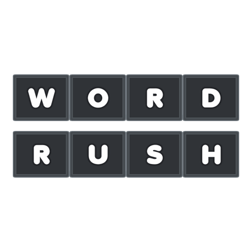

# About 
Game created as part of the Kenney Jam 2025
- The game is also competing in the Single Pack challenge

This is a simple word typing game. Try to get a high score, avoid mistakes.

This is a fast-paced game that puts your typing speed and accuracy to the test! Words will appear on the screen one by one, and your mission is simple: type them correctly before time runs out.

# How to Play

- Words will appear on the screen. 
- Type each word exactly as shown, as soon as you get the last letter correct, you will be awarded points - and a new word.
- Do not let the timer run out, or the game will be over.
- You get 3 mistakes per game

# Scoring System

- points awarded per completed word are based on how fast the word was completed
- there are also penalty points: for each mistake and for timing out

# Achievements

- The game has some basic achievements in place

---

### Kenney Jam 2025 Theme - Power
The game has a points boost mechanic, which I think fits within the theme.

---

#### To Do

- Add actual text to the game to replace some of the image-based UI (due to Jam challenge)

---

## Dev Instructions

1. Clone the repository.
2. Install dependencies with `npm install`.
3. Start the development server with `npm run dev`.
4. If you want to build the project, run `npm run build`.
